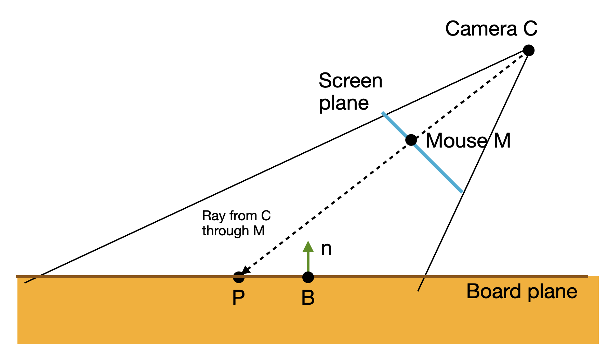

# COMP2160 Prac Week 11 - Camera

## Topics Covered:
* Screen and viewport coordinate frames
* Mouse input
* Camera tracking

## Today's task

Today's task combines two related ideas – mouse input and camera coordinate frames - to build a point-and-click UI to move a marble around a level.

The template project already implements the marble movement and a basic UI Manager to select a target position for it to move to. Familiarise yourself with this code.

## Step 1 - Complete UIManager.MoveCrosshair

The first task is to make the crosshair follow the mouse cursor, in the method `UIManager.MoveCrosshair`. 

1. Before you begin, use Debug.Log to examine the value being returned by `mouseAction.ReadValue`. What coordinate system is this value in?

We want to set the value of `crosshair.transform` which is given in world coordinates. 

2. Look at the methods available on the [Camera](https://docs.unity3d.com/ScriptReference/Camera.html) class. Which one would be appropriate?

You can use the [`Camera.main`](https://docs.unity3d.com/ScriptReference/Camera-main.html) property to access the main camera in the scene.

3. Complete `UIManager.MoveCrosshair` to make the crosshair follow the mouse cursor.

There are two QA scenes in Scenes/QA to test this function with an orthogrpahic camera and a perspective camera. Play both scenes to test your code works.

## Step 2 - Zoom

If you select the main camera in the scene, you can see a white gizmo in the shape of a box that shows the 'view volume' of the camera: i.e. the space of objects it can see. 

1. Set the camera projection to **Orthographic** and adjust the **Size** setting. Notice how this changes the view volume.

2. Set the camera projection to **Perspective** and adjust the **Field of View** setting. Notice how this changes the view volume.

The Actions asset provided (in the Actions folder) already defines a `mouse.zoom` action connected to the mouse scrollwheel.

3. Write a new `CameraZoom` script that adjusts the size of the camera view volume based on the value of this action, between sensible minimum and maximum values. Your script should work for both orthographic and perspective cameras. 

4. Test that your crosshair code still works when the camera is zoomed in or out.

## Step 3 - Make the camera follow the marble

We want the camera to follow the marble around the scene, so the marble is always in the middle of the screen.

1. Try attaching the camera to the marble in the Hierarchy. What happens when you play this?

A common trick is to have an invisible 'follower' object that is the focus of the camera view. We can then move the follower around to track other objects in the scene.

2. Create an empty follower object at the same position as the marble (but not attached to it). 
3. Attach the camera to the follower instead of the marble.
4. Write a script that makes the follower move to the same position as the marble every frame.
5. **Debugging**: Add a Gizmo that draws a wire sphere at the follower location.
6. **QA**: Test that your crosshair movement still works when the camera moves.

## To receive half-marks for today, show your demonstrator:
* Your camera zoom code.
* Your "Follower" object and gizmo.
  
## Step 4 - Changing the camera angle

Suppose we want to play the game in an tilted view rather than a top-down view. 

1. *QA*: Create two new QA scenes with the camera at a 45° angle to the table (one with an orthographic camera and one with a perspective camera). Does your code currently work in this camera view?

We want to map a screen position to a point on a plane that is at an angle to the camera. We can do this easily using raycasting, as shown in the diagram below. 

* The camera is an position **C** and the mouse cursor is at position **M**. We can use the function [`Camera.ScreenPointToRay`](https://docs.unity3d.com/ScriptReference/Camera.ScreenPointToRay.html) to calculate a ray from **C** that passes through **M** (in world coordinates).

* The board is represented by a plane at position **B**. The rotation of the plane is given by the *normal* vector **n** which is at right angles to the plane. We can represent this using the [`Plane`](https://docs.unity3d.com/ScriptReference/Plane.html) class.

* We want to put the crosshair at the point **P** where the ray hits the plane. This can be calculated using the [`Plane.Raycast`](https://docs.unity3d.com/ScriptReference/Plane.Raycast.html) and [`Ray.GetPoint`](https://docs.unity3d.com/ScriptReference/Ray.GetPoint.html) methods. 

2. Use these methods to implement a crosshair that works in the isometric view. Test this in all four of your QA scenes, with different zoom levels.

## Step 5 - Don't move the crosshair when the camera moves

When the camera moves, the crosshair currently moves with it (in world coordinates) to maintain the same screen coordinates. Suppose instead we want to keep the crosshair at the same world coodinates. 

We can do this by using the defined `mouse.delta` action which is provided the change in mouse position (in screen coordinates). Instead of setting the crosshair position to the mouse position, we want to move the crosshair so that its screen position moves by an amount equal to this delta.

1. Plan how to do this. What is the right way to move the crosshair?

2. Update `UIManager.MoveCrosshair` to implement this feature. Include a setting to allow you to switch between the old and new behaviours.

3. In this mode, it is possible for the crosshair to move off the screen. Add some code to move the crosshair to the closest on-screen position if this happens. (Hint: the `Rect.Clamp` provided by Utils/RectExtensions can help.)

## Step 6 - Change the camera target

1. Experiment with changing the camera follow to follow different points in the scene, e.g. the crosshair or the target. How does this affect the behavioural of the controls.

2. Extend the follower class to take two targets and follow a point some proportion of the way between them.

## To receive full-marks for today, show your demonstrator:
* Your QA scenes for scenes for changing the camera angle.
* Your crosshair not moving when the camera moves.
* Your changed camera target.

## Step 7 (Bonus) - Less strict tracking

Suppose we want to allow the target some freedom of movement while keeping it roughly in the centre of the screen. Let's say we will allow the target to stay in a box 50% of the width and height of the screen, as shown in the diagram below.

1. Add Rect parameter to the Follower class to set this boundary. The coordinates should be given in **viewport** coordinates (as proportions of screen width and height) rather than in screen coordinates.

2. Add a gizmo to draw this rectangle. Note: Gizmos are drawn in world coordinates, so you'll need to convert view coordinates to world.

3. On paper, draw a diagram from a side-on view, showing the positions of the target T, camera C amd follower F, where the target is outside the boundary.

4. Calculate what movement would need to be applied to F in order to move the camera to keep T inside the boundary.

5. Write code to implement this.

